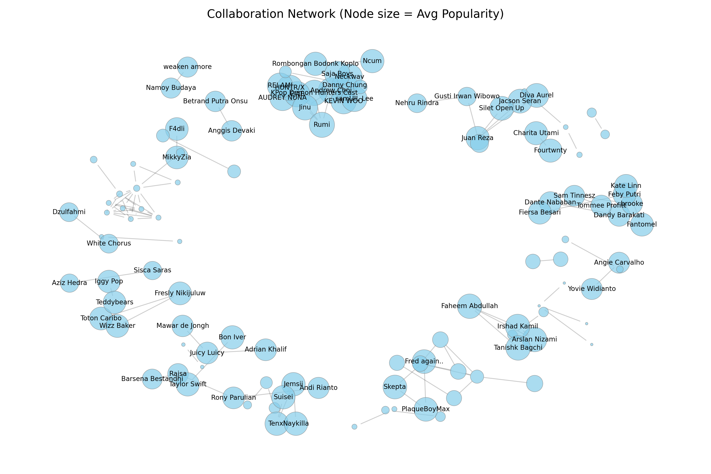

# How Collaborations Shape Success in Music Industry

This project explores how collaborations between artists shape their success and popularity in the music industry.
We combine Spotify track-level metadata with Social Network Analysis (SNA) to reveal collaboration structures, communities, and their impact on artist popularity.

## Result Example

### All Network

### Big Network

- Community 1: Large, international, high popularity, cross-country collaborations.
- Community 24: Large, local (Indonesia), lower popularity, tight intra-local ties.

## Insights

- There are many small isolated communities, but two large ones dominate.
- The international community shows higher popularity, cross-border collaboration, and high centrality.
- The Indonesian community shows lower popularity, but dense local collaboration patterns.
- Collaboration strongly correlates with visibility and potential reach in the industry.